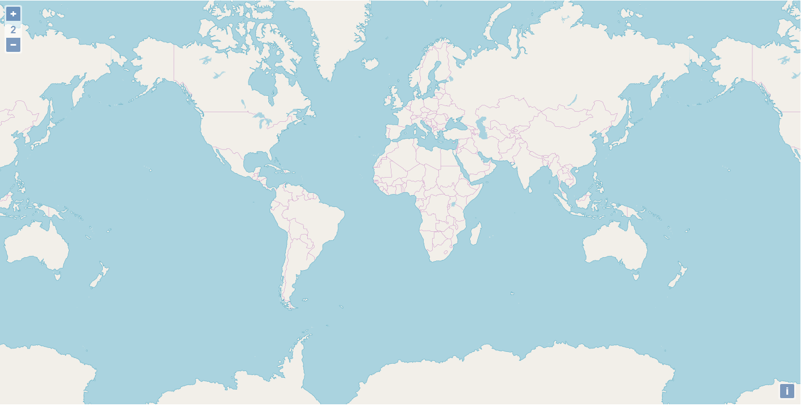

# ol-zoom-level

OpenLayers zoom level library. Adds a zoom level view on an OpenLayers map that displays the current zoom level.



## Demo

You can test a fully functional working live demo [here](https://codepen.io/bampakoa/full/gKBKMB/).

## Installation

You can install ol-zoom-level using npm:

`npm install ol-zoom-level --save`

## Usage

To use ol-zoom-level, first you need to load OpenLayers javascript library along with its corresponsing CSS.

```
  <script src="https://openlayers.org/en/v4.6.5/build/ol.js"></script>
  <link rel="stylesheet" href="https://openlayers.org/en/v4.6.5/css/ol.css" type="text/css">
```
Then, load the ol-zoom-level library from `node_modules`

`<script src="./node_modules/ol-zoom-level/build.js"></script>`

Finally, in your existing OpenLayers application, add ol-zoom-level HTML element and pass the OpenLayers map object as a property. Here's a simple example:

```
const zoomLevel = document.createElement('ol-zoom-level');

// map is the OpenLayers map object
zoomLevel.map = map;

document.body.appendChild(zoomLevel);
```

> Please note that if you are creating the zoom level control synchronously with the creation of the map, you may need to introduce a timeout so that the map has enough time to instantiate.

## Known Limitations

Please check browser compatibility for custom elements as described in Angular official documentation [here](https://angular.io/guide/elements#browser-support-for-custom-elements)

## Development

To get started locally, follow these instructions:

1. If you haven't done it already, [make a fork of this repo](https://github.com/Developer-Plexscape/ol-zoom-level/fork).
2. Clone to your local computer using `git`.
3. Make sure that you have Node 8 or later installed. See instructions [here](https://nodejs.org/en/download/).
4. Run `npm install` to install all the dependencies.

### Usage

Run `npm start` to start the application. You will then be able to access it at http://localhost:4200

### Building

To build the application, you will need a Linux environment. In case you are in a Windows 10 machine you can install [Ubuntu Bash](https://msdn.microsoft.com/en-us/commandline/wsl/install-win10) alternatively.

If that is the case consider installing the Node using a [package manager](https://nodejs.org/en/download/package-manager/).
